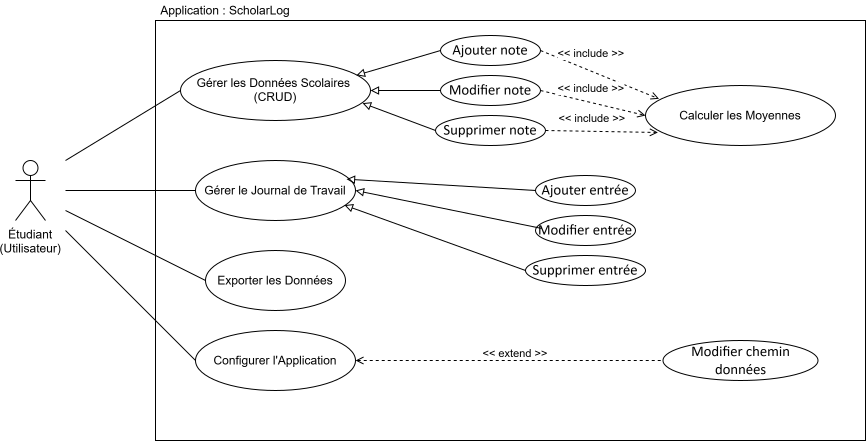
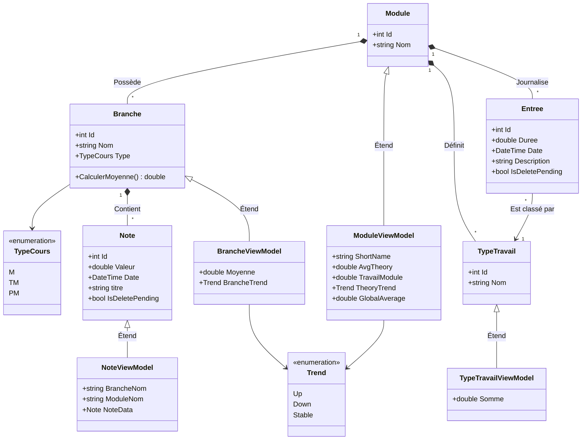

# Diagrammes

## Cas utilisation 

## MCD

## Classes

``` mermaid
classDiagram
    %% Énumérations
    class TypeCours {
        <<enumeration>>
        M
        TM
        PM
    }
    class Trend {
        <<enumeration>>
        Up
        Down
        Stable
    }

    %% Modèles de données (Entités EF Core)
    class Module {
        +int Id
        +string Nom
    }
    class Branche {
        +int Id
        +string Nom
        +TypeCours Type
        +CalculerMoyenne() double
    }
    class TypeTravail {
        +int Id
        +string Nom
    }
    class Entree {
        +int Id
        +double Duree
        +DateTime Date
        +string Description
        +bool IsDeletePending
    }
    class Note {
        +int Id
        +double Valeur
        +DateTime Date
        +string titre
        +bool IsDeletePending
    }

    %% Modèles de vue (MVVM pour Avalonia)
    class ModuleViewModel {
        +string ShortName
        +double AvgTheory
        +double TravailModule
        +Trend TheoryTrend
        +double GlobalAverage
    }
    class BrancheViewModel {
        +double Moyenne
        +Trend BrancheTrend
    }
    class TypeTravailViewModel {
        +double Somme
    }
    class NoteViewModel {
        +string BrancheNom
        +string ModuleNom
        +Note NoteData
    }

    %% Relations de composition (1 à plusieurs)
    Module "1" *-- "*" Branche : Possède
    Module "1" *-- "*" Entree : Journalise
    Module "1" *-- "*" TypeTravail : Définit
    Branche "1" *-- "*" Note : Contient

    %% Associations simples
    Entree "*" --> "1" TypeTravail : Est classé par

    %% Relations d'héritage (ViewModels étendant les Entités)
    Module <|-- ModuleViewModel : Étend
    Branche <|-- BrancheViewModel : Étend
    TypeTravail <|-- TypeTravailViewModel : Étend
    Note <|-- NoteViewModel : Étend
    
    %% Liens vers les énumérations
    Branche --> TypeCours
    BrancheViewModel --> Trend
    ModuleViewModel --> Trend
```