# Interface de l'application
Style visé : dashboard moderne en thème sombre, orienté suivi de performance.
- Interface dark mode avec forts contrastes
- Sidebar latérale simple avec navigation claire
- Typographie sans-serif hiérarchie visuelle marquée
- Design minimaliste, fonctionnel, centré sur la lisibilité rapide des données.

## Maquette interractif 
La maquette interactive présente le flux de navigation complet et le comportement des écrans principaux.    
Elle permet de visualiser les transitions, les zones cliquables et la hiérarchie des informations avant implémentation.   

Lien vers maquette interractif -> [Penpot/Maquette](https://penpot.kreativcam.ch/#/view?file-id=255dee3d-9464-811c-8007-7cee81528364&page-id=255dee3d-9464-811c-8007-7cee81528365&section=interactions&index=0&share-id=6f19317a-c44f-8084-8007-84b8385845b2) 

## Accueil
Le menu accueil permet à l'utilisateur de voir les moyenne des différents modules à l'ouverture de l'application.
Au clique sur un module, les moyennes des branches et le journal de travail lié au module s'affiche.

| Accueil - Ouverture de l'application                              | Accueil - Clique sur module                                                       |
| ---                                                               | ---                                                                               |
| 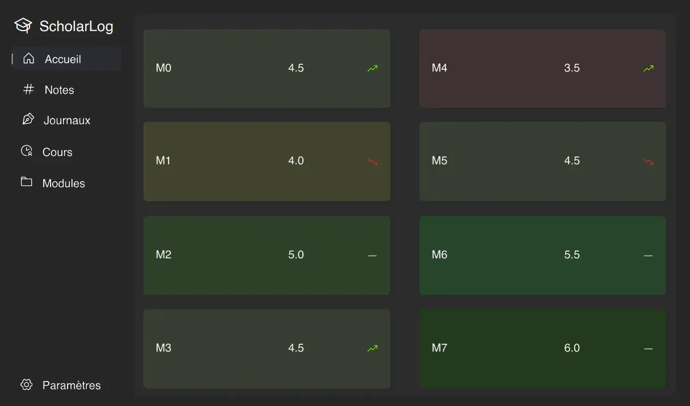   | 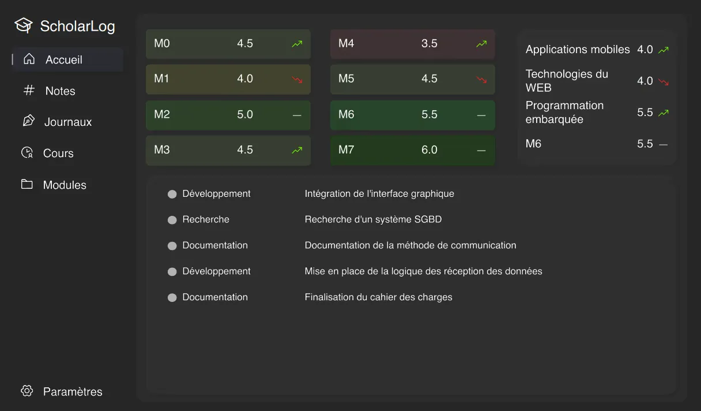  |

## Note
Le menu Notes permet à l'utilisateur de gérer l'ensemble de ses résultats scolaires en assurant la saisie, la modification et la suppression des notes.

| Note - Accueil                                                    | Note - Clique ajouter/modifier note                                               |
| ---                                                               | ---                                                                               |
| 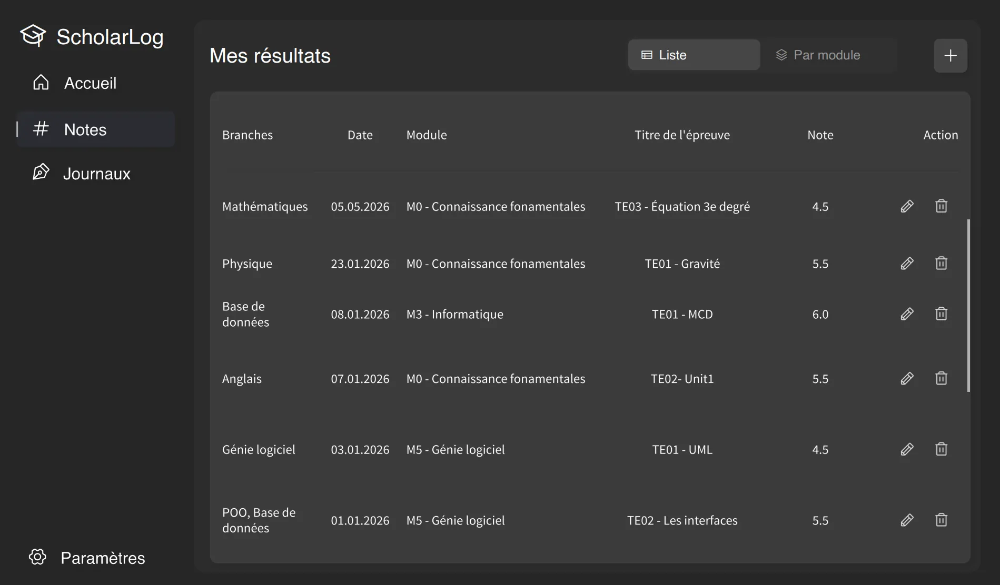         | 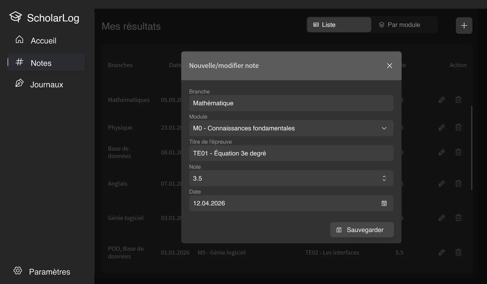|

## Journal
Le menu Journal permet à l'utilisateur de gérer le suivit du module/travail en assurant la saisie, la modification et la suppression des notes. 
L'utilisateur peut également éditer les catégories d'entrées. L'exportation est également compris dans ce menu

|                                                                                         |                                                                    |
| ---                                                                                                   | ---                                                                                                   |
| Accueil 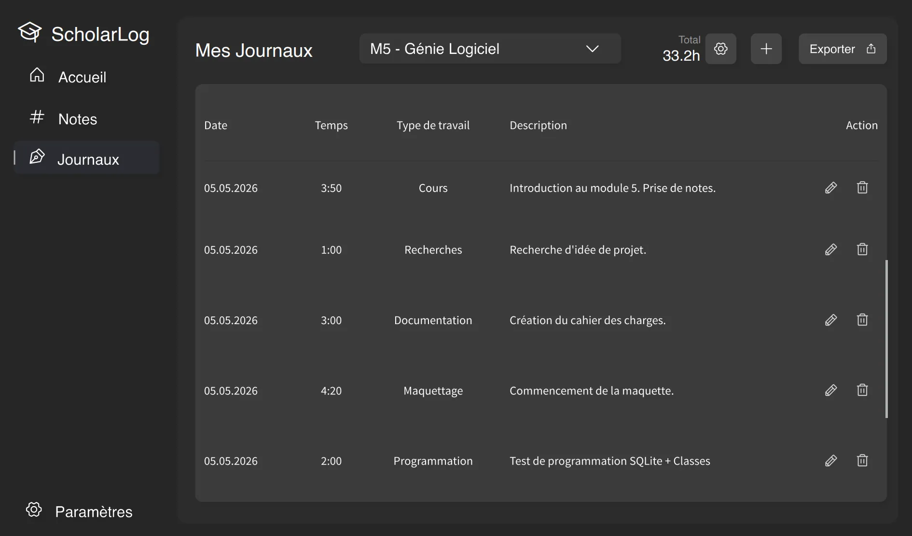                        | Clique modules 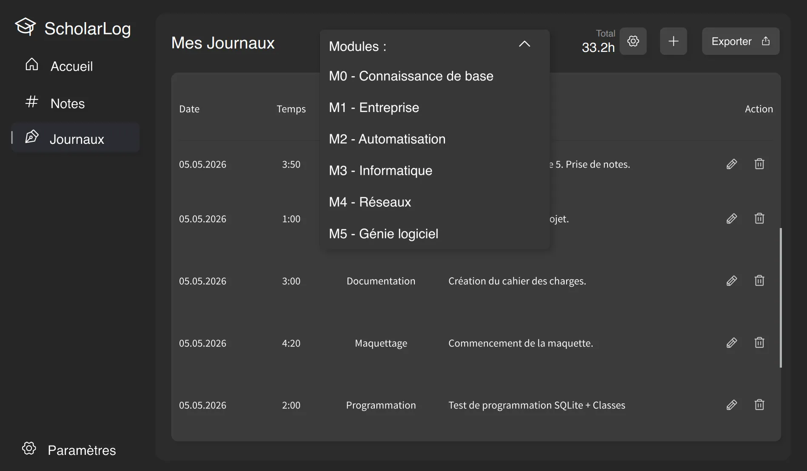       |
| Édition entrée 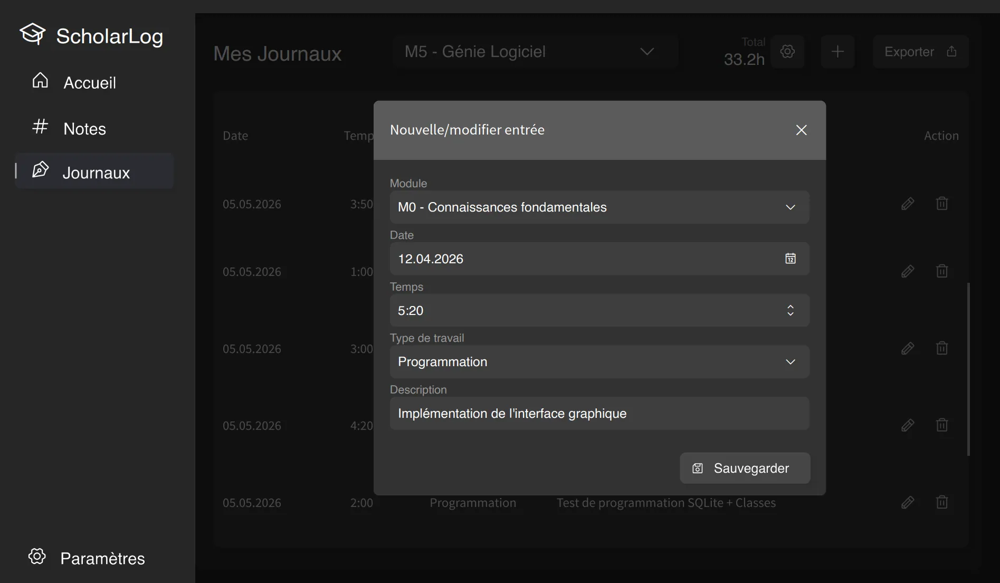    | Édition catégorie 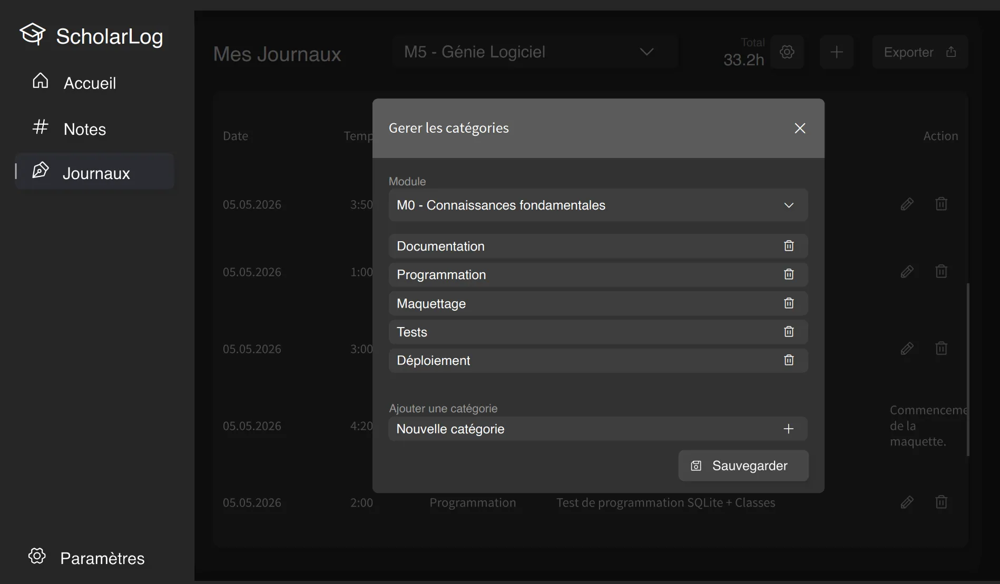 |
| Export MD 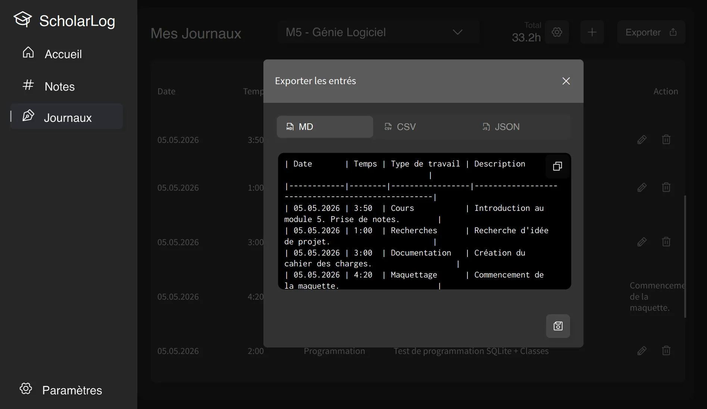                | Export CSV 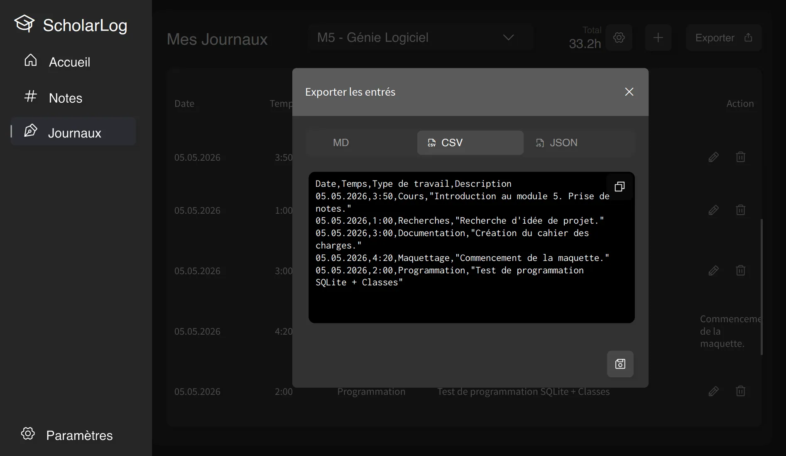             |
| Export JSON 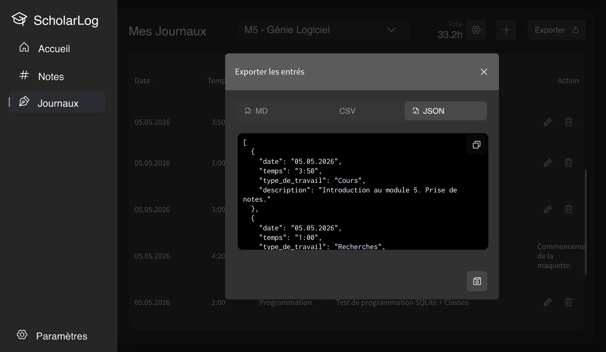          |                                                                                                       |
