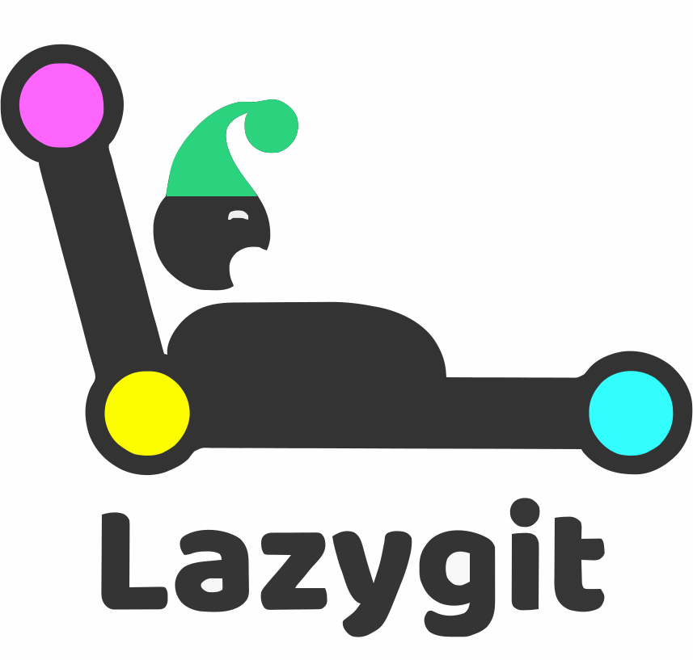
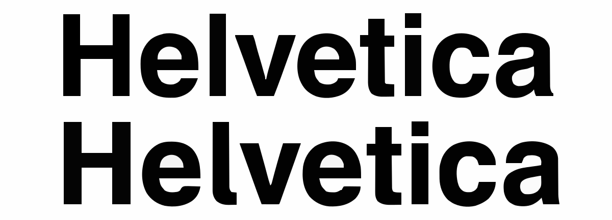
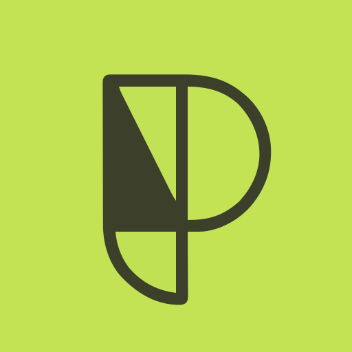

 <!-- Shields (badges) -->

  <!-- https://github.com/Ileriayo/markdown-badges - MIT License - 2020 Ileriayo Adebiyi -->
  
  
  
  
  
  
  
  
  

## Table des matières

- [ScholarLog](#scholarlog)
- [Objectif](#objectif)
- [Technologies](#technologies)
- [Utilisateurs cibles](#utilisateurs-cibles)
- [Fonctionnalités principales](#fonctionnalités-principales)
- [Ressources utilisés](#ressources-utilisés)
  - [Logiciels](#logiciels)
  - [Police d'écriture](#police-décriture)

# ScholarLog
Logiciel GUI (mono-utilisateur) d'inscription de notes et de journal de travail

Voir interface -> [README Interface](./Interface)

## Objectif
Développer une application de bureau permettant à un élève de gérer et suivre ses résultats scolaires de manière locale et autonome.

## Technologies
- Langage : C#
- Framework UI : Avalonia UI
- Base de données : SQLite (stockage local)

## Utilisateurs cibles
- Usage individuel
- Élève en formation ES

## Fonctionnalités principales
### Gestion scolaire
- Ajout et modification de :
  - Notes
  - Cours
  - Modules
  - Projets

### Suivi
- Calcul automatique des moyennes
- Journal de travail (suivi journalisé)

### Exportation
- Export des données en :
  - Fichier tableur (type Excel)
  - Fichier CSV

# Ressources utilisés
## Logiciels
| Logo | Application | Utilité | Licence | Lien |
|------|-------------|---------|---------|------|
|  | **LazyGit** | Interface graphique en terminal pour la gestion des dépôts Git (commits, branches, merges). | MIT | https://github.com/jesseduffield/lazygit |
|  | **OnlyOffice** | Suite bureautique utilisée pour la rédaction et l’édition des documents du projet (DOCX, XLSX). | AGPL-3.0-only | https://www.onlyoffice.com |
|  | **Penpot** | Outil de conception d’interfaces (UI/UX) utilisé pour la création des maquettes. | AGPL-3.0-only | https://penpot.app |
|  | **Draw.io** | Outil de conception de diagrammes. Utilisé pour la conception UML | Apache 2.0 | https://github.com/jgraph/drawio |
|  | **JetBrains Rider** | Environnement de développement (IDE) utilisé pour le développement et le débogage des applications .NET. | Propriétaire | https://www.jetbrains.com/rider/ |

## Police d'écriture
| Logo      | Nom       | Lien                                      | Utilité               | 
| ---       | ---       | ---                                       | ---                   |
|  | Hevletica | https://font.download/font/helvetica-255  | Textes                |
|        | Phosphor  | https://phosphoricons.com/                | Affichage des icones  |
