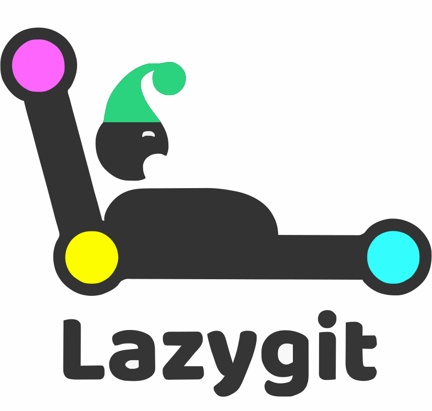
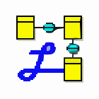
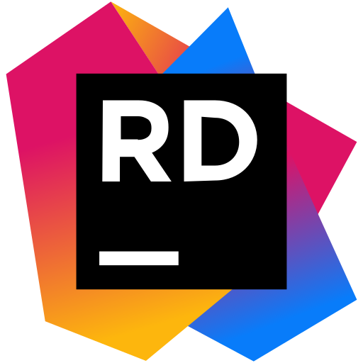
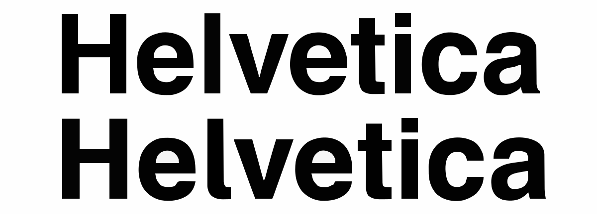
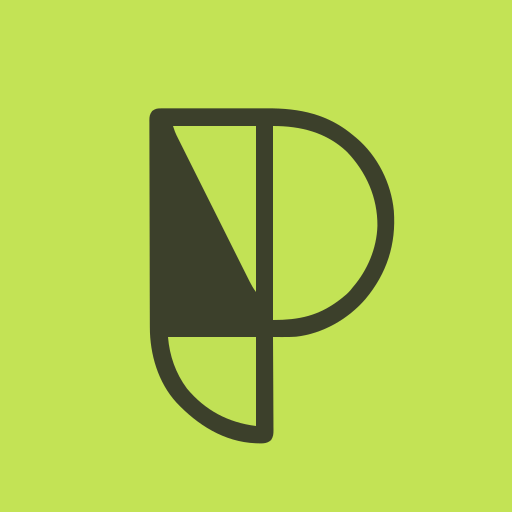

 <!-- Shields (badges) -->

  <!-- https://github.com/Ileriayo/markdown-badges - MIT License - 2020 Ileriayo Adebiyi -->
  
  
  
  
  
  
  
  
  

## Table des matières

- [ScholarLog](#scholarlog)
- [Objectif](#objectif)
- [Technologies](#technologies)
- [Utilisateurs cibles](#utilisateurs-cibles)
- [Fonctionnalités principales](#fonctionnalités-principales)
- [Ressources utilisées](#ressources-utilisées) 
  - [Logiciels](#logiciels)
  - [Police d'écriture](#police-décriture)

# ScholarLog
Logiciel GUI (mono-utilisateur) d'inscription de notes et de journal de travail

Voir interface -> [README Interface](./Interface)     
Lien vers maquette interractif -> [Penpot/Maquette](https://penpot.kreativcam.ch/#/view?file-id=255dee3d-9464-811c-8007-7cee81528364&page-id=255dee3d-9464-811c-8007-7cee81528365&section=interactions&index=0&share-id=6f19317a-c44f-8084-8007-84b8385845b2) 

## Objectif
Développer une application de bureau permettant à un élève de gérer et suivre ses résultats scolaires de manière locale et autonome.

## Technologies

| Catégorie        | Technologie    | Détails                   | Version   |
|---               |---             |---                        |---        |
| Langage          | C#             | Développement principal   | 14.0      |
| Framework UI     | Avalonia UI    | Interface multiplateforme | 12.0      |
| Base de données  | EF core        | Stockage local de la BDD  | 10.0.5    |

## Utilisateurs cibles
- Usage individuel
- Élève en formation ES

## fonctionnalités principales

### Gestion des résultats (Notes)
* **Structure hiérarchique :** Organisation logique par Modules et Branches.
* **Calcul automatisé  :** Moyennes des branches calculées dynamiquement et arrondies au 0.5 le plus proche.
* **Aperçu PDF intégré :** Possibilité de joindre et de lire directement les documents PDF (ex: évaluations scannées) liés à une note grâce à une visionneuse intégrée.

### Journal de travail (Time Tracking)
* **Suivi journalisé :** Enregistrement des entrées documentant le temps passé par module, incluant la date, la durée et une description.
* **Catégorisation dynamique :** Création et gestion de catégories de travail (ex: Programmation, Recherche, Documentation) personnalisables pour chaque module.
* **Visualisation :** Tableau de bord interactif avec un diagramme en secteurs (Donut Chart) illustrant la répartition des heures par type de travail.

### Exportation Universelle
* **Formats supportés :**
    * **Markdown (MD) :** Tableaux parfaitement alignés et résumés structurés des moyennes.
    * **CSV :** Format brut optimisé pour l'importation sur Excel ou d'autres tableurs.
    * **JSON :** Structure hiérarchique propre.
* Possibilité de copier les données directement dans le presse-papier ou de les sauvegarder sur le disque local.

### Interface & Technique
* **Tableau de bord :** Vue d'ensemble des modules avec indicateurs de tendance visuels (en hausse, en baisse, stable) pour voir la tendance des notes.
* **Thème et Ergonomie :** Interface moderne avec thème sombre réduisant la fatigue visuelle. 
* **Données 100% Locales :** Base de données SQLite embarquée. Possibilité de configurer l'emplacement du fichier de sauvegarde depuis les paramètres.
* **Multi-plateforme :** Développé avec le framework Avalonia UI en C#, garantissant un fonctionnement natif sur Windows, macOS et Linux.

# Ressources utilisées
## Logiciels
| Logo | Application | Version | Utilité | Licence |
| :---: | :--- | :--- | :---: | :--- |
|  | [**LazyGit**](https://github.com/jesseduffield/lazygit) | 0.58.1 | Interface graphique en terminal pour la gestion des dépôts Git (commits, branches, merges). | MIT |
|  | [**OnlyOffice**](https://www.onlyoffice.com) | 9.3.1 | Suite bureautique utilisée pour la rédaction et l’édition des documents du projet (DOCX, XLSX). | AGPL-3.0 |
|  | [**Penpot**](https://penpot.app) | 2.13.0 | Outil de conception d’interfaces (UI/UX) utilisé pour la création des maquettes. | AGPL-3.0 |
|  | [**Draw.io**](https://github.com/jgraph/drawio) | 29.3.6 | Outil de conception de diagrammes. Utilisé pour la conception UML. | Apache 2.0 |
|  | [**Looping**](https://www.looping-mcd.fr/) | 4.1 | Logiciel de modélisation conceptuelle de données (MCD). | Freeware |
|  | [**JetBrains Rider**](https://www.jetbrains.com/rider/) | 2026.1 | Environnement de développement (IDE) utilisé pour le développement et le débogage des applications .NET. | Propriétaire |

## Police d'écriture
| Logo      | Nom       | Lien                                      | Utilité               | 
| ---       | ---       | ---                                       | ---                   |
|  | Helvetica | https://font.download/font/helvetica-255  | Textes                |
|        | Phosphor  | https://phosphoricons.com/                | Affichage des icones  |
