# ScanHandler
Ce module a pour objectif de transformer des documents PDF volumineux en archives CBZ (Comic Book Archive) optimisées. Cette transformation permet de réduire drastiquement l'empreinte mémoire des documents avant leur stockage dans une base de données SQLite sous forme de BLOB.

Le but ultime est de garantir que le stockage total des scans ne dépasse pas 60 Mo pour l'ensemble de la base de données, tout en conservant une lisibilité optimale. L'architecture 100% asynchrone (basée sur IAsyncEnumerable et Task.Run) garantit une interface graphique (GUI) fluide et non-bloquante, avec une empreinte RAM minimale.

| Classe             | Rôle Principal                                                                                   |
|--------------------|--------------------------------------------------------------------------------------------------|
| ImageProcessor     | Calculs géométriques et redimensionnement haute qualité délégués sur des threads d'arrière-plan. |
| PdfManager         | Extraction asynchrone des flux d'images depuis un PDF et génération de fichiers .pdf.            |
| ArchiveManager     | Lecture/Écriture des archives .cbz en mémoire ou sur disque sans bloquer le thread principal.    |
| DirectoryManager   | Pont asynchrone entre les flux d'images en mémoire et le système de fichiers.                    |


## Diagramme de classe 

``` mermaid
classDiagram

  class ImageProcessor {
    %% Responsabilité : Manipulation d'images en mémoire %%
    +ResizeToMaxPixelsAsync(source: SKBitmap, maxPixels: double, quality: SKFilterQuality)$ Task~SKBitmap~
    +ResizeImagesAsync(source: IAsyncEnumerable~SKBitmap~, maxPixels: double, ct: CancellationToken)$ IAsyncEnumerable~SKBitmap~
  }

  class PdfManager {
    %% Responsabilité : Génération et lecture de PDF %%
    +CreatePdfAsync(images: IAsyncEnumerable~SKBitmap~, pdfPath: string, quality: int, cancellationToken: CancellationToken)$ Task
    +ExtractImagesAsync(pdfPath: string, cancellationToken: CancellationToken)$ IAsyncEnumerable~SKBitmap~
  }

  class ArchiveManager {
    %% Responsabilité : Manipulation de fichiers compressés %%
    +ExtractImagesAsync(pathToArchive: string, cancellationToken: CancellationToken)$ IAsyncEnumerable~SKBitmap~
    +CompressDirectoryAsync(sourceDirectory: string, destinationZipFilePath: string)$ Task
    +IsSupportedImageFilePDF(filePath: string)$ bool
    +CreateCbzInMemoryAsync(images: IAsyncEnumerable~SKBitmap~, format: SKEncodedImageFormat, quality: int, cancellationToken: CancellationToken)$ Task~byte[]~
    +ExtractImagesFromMemoryAsync(cbzData: byte[], cancellationToken: CancellationToken)$ IAsyncEnumerable~SKBitmap~
  }

  class DirectoryManager {
    %% Responsabilité : Interactions avec les dossiers classiques %%
    +GetImagesFromDirectoryAsync(folderPath: string, cancellationToken: CancellationToken)$ IAsyncEnumerable~SKBitmap~
    +SaveImagesAsync(images: IAsyncEnumerable~SKBitmap~, outputFolder: string, format: SKEncodedImageFormat, quality: int, cancellationToken: CancellationToken)$ Task
  }

  %% Relations d'utilisation (dépendances) %%
  DirectoryManager ..> ArchiveManager : utilise (IsSupportedImageFilePDF)
    
```


## Code d'exemple 
```csharp
class Program
{
    static async Task Main(string[] args)
    {
        string pdf = @"C:\Users\lukas\Desktop\ScholarLog\PoC\CBZ\TEST\base.pdf";

        if (!File.Exists(pdf))
        {
            Console.WriteLine("Erreur : Le fichier PDF source est introuvable.");
            return;
        }

        string finalPdfPath = Path.Combine(Path.GetDirectoryName(pdf), "Generated.pdf");

        Console.WriteLine("Démarrage de la démonstration asynchrone...\n");

        // 1. Lancement du travail lourd en arrière-plan
        Task processingTask = RunPipelineAsync(pdf, finalPdfPath);

        // 2. Animation sur le Thread principal prouvant que l'UI ne fige pas
        char[] spinner = { '|', '/', '-', '\\' };
        int counter = 0;

        while (!processingTask.IsCompleted)
        {
            Console.Write($"\r[UI Thread] L'interface reste 100% réactive... {spinner[counter % spinner.Length]}");
            counter++;
            await Task.Delay(100); 
        }

        await processingTask; // Capture des éventuelles exceptions

        Console.WriteLine("\n\nDémonstration 100% In-Memory terminée !");
    }

    static async Task RunPipelineAsync(string pdf, string finalPdfPath)
    {
        // Étape 1 : Extraction et redimensionnement à la volée
        var pdfImages = PdfManager.ExtractImagesAsync(pdf);
        var resizedImages = ImageProcessor.ResizeImagesAsync(pdfImages, 2_000_000); // 2 Mp

        // Étape 2 : Création de l'archive CBZ directement en RAM
        byte[] cbzBlob = await ArchiveManager.CreateCbzInMemoryAsync(resizedImages, SKEncodedImageFormat.Webp, 35);

        Console.WriteLine($"\n\n[Background Task] Étape 2 terminée.");
        double sizeInKb = cbzBlob.Length / 1024.0;
        Console.WriteLine($"[INFO] Taille du CBZ en mémoire (Futur BLOB SQLite) : {sizeInKb:F2} Ko");

        // Étape 3 : Génération du PDF final depuis la RAM 
        Console.WriteLine("[Background Task] Démarrage de l'étape 3 (Génération PDF)...");
        var cbzImages = ArchiveManager.ExtractImagesFromMemoryAsync(cbzBlob);  
        await PdfManager.CreatePdfAsync(cbzImages, finalPdfPath, quality: 35);
    }
}
```