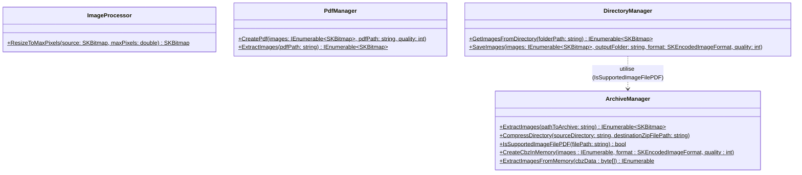

# ScanHandler
Ce module a pour objectif de transformer des documents PDF volumineux en archives CBZ (Comic Book Archive) optimisées. Cette transformation permet de réduire drastiquement l'empreinte mémoire des documents avant leur stockage dans une base de données SQLite sous forme de BLOB.

Le but ultime est de garantir que le stockage total des scans ne dépasse pas 60 Mo pour l'ensemble de la base de données, tout en conservant une lisibilité optimale.


| Classe           | Rôle Principal                                                             |
|------------------|----------------------------------------------------------------------------|
| ImageProcessor   | Calculs géométriques et redimensionnement haute qualité.                   |
| PdfManager       | Extraction des flux d'images depuis un PDF et génération de fichiers .pdf. |
| ArchiveManager   | Lecture/Écriture des archives .cbz et filtrage des formats supportés.      |
| DirectoryManager | Pont entre les flux d'images en mémoire et le système de fichiers          |


## Diagramme de classe 


## Code d'exemple 
```csharp
string pdf = @"C:\Users\lukas\Desktop\ScholarLog\PoC\CBZ\TEST\base.pdf";

if (!File.Exists(pdf))
{
    Console.WriteLine("Erreur : Le fichier PDF source est introuvable.");
    return;
}

string finalPdfPath = Path.Combine(Path.GetDirectoryName(pdf), "Generated.pdf");

// Pipeline d'extraction et de redimensionnement
Console.WriteLine("Étape 1 : Extraction et redimensionnement à la volée");
var pdfImages = PdfManager.ExtractImages(pdf);
var resizedImages = pdfImages.Select(img => ImageProcessor.ResizeToMaxPixels(img, 2_000_000)); // 2 Mp

// Création de l'archive CBZ directement en RAM
Console.WriteLine("\nÉtape 2 : Création de l'archive CBZ en mémoire");
byte[] cbzBlob = ArchiveManager.CreateCbzInMemory(resizedImages, SKEncodedImageFormat.Webp, 35);

// Afficher la taille que prendra le fichier dans la BDD
double sizeInMb = cbzBlob.Length / 1024.0;
Console.WriteLine($"[INFO] Taille du CBZ en mémoire (Futur BLOB SQLite) : {sizeInMb:F2} Ko");

// Génération du PDF final depuis la mémoire 
Console.WriteLine("\nÉtape 3 : Génération du PDF final depuis la RAM");

// On relit le byte[] comme si on venait de faire un "SELECT BlobData FROM Scans"
var cbzImages = ArchiveManager.ExtractImagesFromMemory(cbzBlob);  
PdfManager.CreatePdf(cbzImages, finalPdfPath, quality: 35);

Console.WriteLine("\nDémonstration 100% In-Memory terminée !");
```